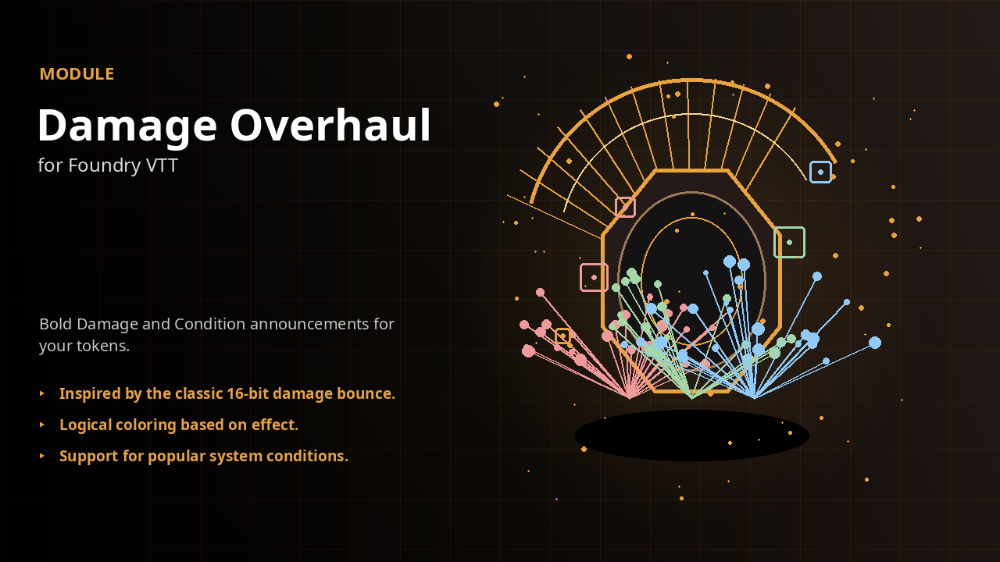

<div align="center">
  <a href="https://github.com/apoapostolov/Damage-Overhaul-for-Foundry-VTT">
    
  </a>
</div>

# Damage Overhaul

for Foundry VTT

[](https://foundryvtt.com/)
[](https://github.com/apoapostolov/Damage-Overhaul-for-Foundry-VTT/releases)
[](LICENSE)

Damage Overhaul replaces Foundry's default floating damage and condition text with a readable bounce that starts at the
token's feet. Damage, healing, and conditions use distinct colors. System presets keep common condition names consistent
at the table.

## What's New in 14.0.0

- The module is now a native Foundry v14 package named `damage-overhaul`.
- Overhaul mode restores the signature launch, drop, rebound, and settle motion.
- Announcements start at the token's lower edge instead of the canvas center.
- D&D 5e, Pathfinder 2e, and generic condition presets use the new structured JSON format.
- Standard mode restores Foundry's native scrolling text when you need the core behavior.

## Features

- **Bounce that reads as impact.** Damage and condition announcements launch upward, drop past their anchor, rebound, settle,
  and fade out.
- **Feet-level placement.** Text starts at the lower edge of the token. It reads as an effect on the creature
  instead of a label over its center.
- **Readable size scaling.** Font size follows the configured base size and scales against the target's maximum HP for larger
  hits.
- **Clear condition colors.** Harmful, beneficial, utility, and neutral effects use separate visual treatments.
  Removal text uses its own color rule.
- **System presets.** Choose automatic D&D 5e or Pathfinder 2e mappings, a generic preset for any system, or no
  preset.
- **Custom JSON presets.** Select a JSON file from Foundry's File Picker. A loaded custom file overrides the built-in condition
  preset.
- **Performance controls.** Use the lighter animation path and limit the number of announcements that can remain active
  at once.
- **Native fallback.** Switch Announcement Mode to Standard without disabling the module.
- **Extension API.** Other modules can register announcement strategies and expose them in the setting.

## Installation

### Manifest installation

1. Open **Add-on Modules** in your Foundry setup screen.
2. Select **Install Module**.
3. Paste this manifest URL:

   ```text
   https://raw.githubusercontent.com/apoapostolov/Damage-Overhaul-for-Foundry-VTT/main/module.json
   ```

4. Select **Install**.
5. Enable **Damage Overhaul** in your world.

### Manual installation

1. Download `module.zip` from the [14.0.0 release](https://github.com/apoapostolov/Damage-Overhaul-for-Foundry-VTT/releases/tag/v14.0.0).
2. Extract the archive into your Foundry `Data/modules` directory.
3. Make sure the extracted folder is named `damage-overhaul` and contains `module.json`.
4. Restart Foundry or rescan packages.
5. Enable **Damage Overhaul** in your world.

The release requires Foundry VTT v14. It has no required module dependencies.

## First use

1. Open **Configure Settings** from the Game Settings menu.
2. Open the **Damage Overhaul** settings category.
3. Set **Announcement Mode** to **Overhaul**.
4. Choose **16-bit Videogame** under **Damage Font** if you want the classic pixel look.
5. Choose **Auto (By System)** under **Game System Presets**.
6. Apply damage or a condition to a token.

The GM controls the shared announcement mode, size, presets, sounds, and performance settings. The Debug Overlay is client-only
and does not change what other users see.

## Settings

| Setting | What it controls |
| --- | --- |
| Announcement Mode | Use Overhaul for the bounce animation or Standard for Foundry's native behavior. |
| Damage Font | Use Modern for the current Verdana-first style or 16-bit Videogame for the recovered Press Start 2P font. |
| Font Size | Sets the base text size for a 100-pixel grid. |
| Font Size - Max HP Linear (minimum) | Sets the percentage of maximum HP where size scaling starts. |
| Font Size - Max HP Linear (maximum) | Sets the percentage of maximum HP where size scaling reaches its upper range. |
| Game System Presets | Selects automatic, generic, D&D 5e, Pathfinder 2e, or no condition mapping. |
| Custom Preset File | Loads a JSON condition map that overrides the selected built-in preset. |
| Enable Condition Sound Cues | Plays sounds defined by the selected preset. |
| Performance Mode | Uses the lighter animation path and reduces the active announcement limit. |
| Max Active Announcements | Limits the number of announcements kept on screen at once. |
| Debug Overlay | Shows the selected mode, color, size, and active-text limit for the current client. |

## Custom presets

Custom preset files use condition names as keys. Each entry can define an apply color, a removal color, and optional sound
paths:

```json
{
  "bleeding": {
    "apply": "#ef9a9a",
    "remove": "#a5d6a7",
    "applySound": "sounds/bleeding.ogg",
    "removeSound": "sounds/bleeding-cleared.ogg"
  }
}
```

Use lower-case condition names. The module applies generic polarity colors when a condition is not present in the selected
map.

## Compatibility

Damage Overhaul targets Foundry VTT v14 and is system-agnostic. The included presets cover D&D 5e and Pathfinder 2e. Other
systems use the generic preset and the standard `system.attributes.hp` path when it exists.

This release uses the new `damage-overhaul` module ID. On the first GM load, the module copies matching settings from the
former `scrolling-texts` package when those legacy records are still present. New settings that you already changed are
preserved.
Custom preset files use the new structured JSON format and must be reviewed manually.

## Developer API

The module exposes its strategy API after `ready`:

```js
const damageOverhaul = game.modules.get("damage-overhaul")?.api;

damageOverhaul?.registerStrategy("critical", async (origin, content) => {
  // Render a custom strategy here.
}, { label: "Critical" });
```

Available methods are `registerStrategy`, `unregisterStrategy`, and `getStrategyChoices`. The registration hook is
`damage-overhaul.registerAnimationStrategies`.

## Development

The repository contains the module source and a reproducible release archive workflow. Build the package with:

```bash
python3 ~/.hermes/skills/foundry/foundry-vtt-release-engineering/scripts/foundry-zip.py --out module.zip
```

The archive excludes the `dev/` comparison notes. It includes the manifest, scripts, styles, font, and preset assets.

## License

Damage Overhaul is released under the [MIT License](LICENSE).
